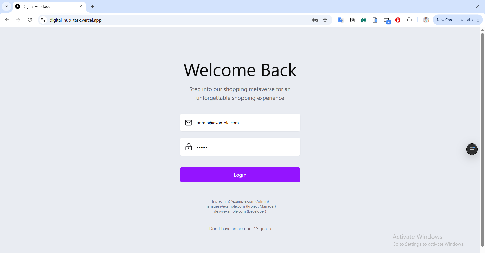
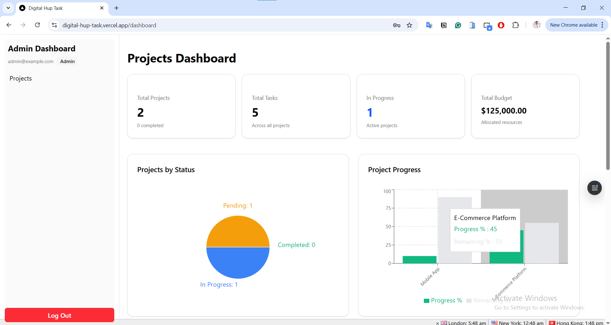
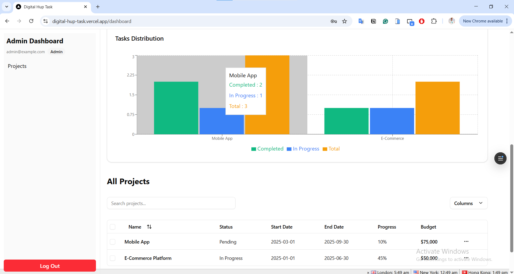
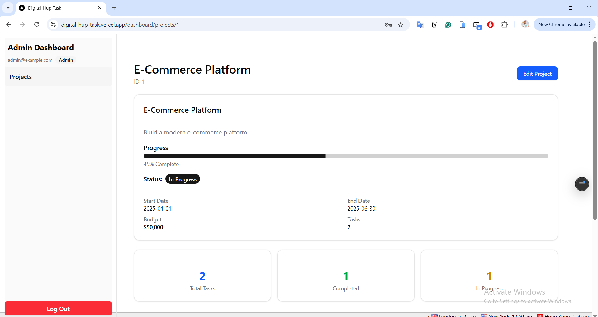
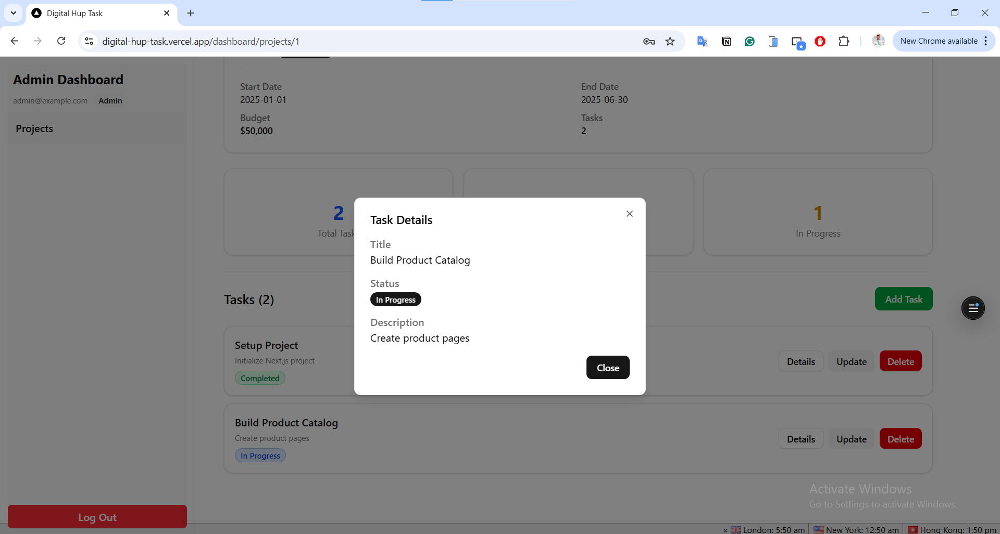

# Project Dashboard

Live demo: [Project Dashboard on Vercel](https://digital-hup-task.vercel.app/)  

  


  


  


  


  

This is a [Next.js](https://nextjs.org) project using **React**, **TypeScript**, **TailwindCSS + ShadCN UI**, and **Prisma ORM** with SQLite for backend database handling.

## Overview

A full-featured Project Dashboard with:

- **JWT login** with role-based access (**Admin**, **Project Manager**, **Developer**)  
- Manage **projects and tasks**  
- **Dashboard** with live statistics and charts  
- Backend using **Next.js API Routes** and **Prisma ORM** for database operations  
- **Real-time updates** from the database without using Redux or large state libraries  
- **Responsive design** for desktop and mobile  
- Form validation using **React Hook Form + Zod**  

## Features

### Authentication

- Login form with validation  
- Save token in **HTTP-only cookies**  
- Role-based access control (RBAC)  
  - **Admin**: view, edit, delete projects & tasks  
  - **Project Manager**: view and edit only  
  - **Developer**: view only  

### Dashboard

- Live project statistics  
- Charts showing:
  - Project progress (**Bar Chart**)  
  - Task distribution (**Stacked Bar Chart**)  
  - Project status (**Pie Chart**)  

### Projects Table

- Search, sort, and pagination  
- Inline editing for some fields  
- Show/hide columns  
- Multi-select projects  

### Project Details & Tasks

- View project details and tasks  
- Add, edit, delete tasks  
- Update project info  
- Real-time updates from backend  

### Backend & Database

- **Next.js API Routes** handle requests  
- **Prisma ORM** interacts with **SQLite** database  
- Models: `User`, `Project`, `Task`  
- Live updates using API + Hooks  

## Login Accounts

| Email | Password | Role |
|-------|----------|------|
| admin@example.com | 123456 | Admin |
| manager@example.com | 123456 | Project Manager |
| dev@example.com | 123456 | Developer |

## Getting Started

Install dependencies:

```bash
npm install
